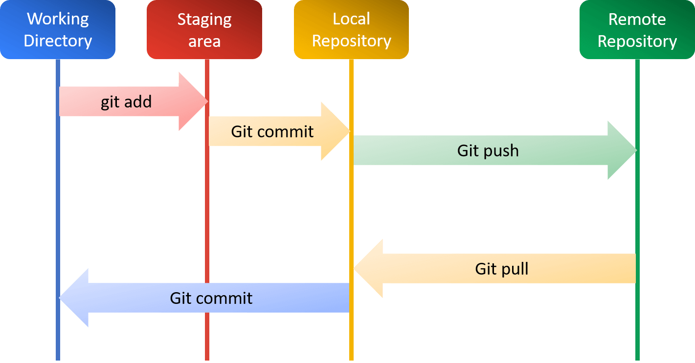

# Prerequisites
```{important}
Please make sure you have read this part before starting the course.
```
## About Operating System
```{note}
If you are already familiar with operating systems, you can skip this section. 
```
### Basic
An **operating system** (OS) is the fundamental software that manages all the hardware and other software on a computer. It serves as an intermediary between computer hardware and the user.
It handles basic tasks such as:

1. **Managing Resources**: The OS manages the computer’s memory, processor, disk space, and other resources, ensuring each program gets what it needs to run smoothly.

2. **User Interface**: The OS provides a user interface (UI), which can be graphical (GUI) like Windows and macOS, or command-line based like Linux. This allows users to interact with the computer through windows, icons, and menus or by typing commands.

3. **Running Applications**: The OS allows you to run multiple applications at the same time. It allocates the necessary resources and ensures that each application operates efficiently without interfering with others.

4. **File Management**: The OS organizes files on storage devices, allowing you to create, delete, move, and organize your data in a structured way.

5. **Security and Access Control**: The OS helps protect your computer by managing user permissions and access rights, ensuring that only authorized users can access certain files and applications.

Common examples of operating systems include ***Microsoft Windows***, ***macOS***, ***Linux***, ***Android***, ***iOS***. 

### Examples
There are brief descriptions of some popular operating systems below:
#### Microsoft Windows
Microsoft Windows is one of the most widely used operating systems in the world. It offers a graphical user interface (GUI), making it user-friendly and accessible for beginners. Windows is known for its compatibility with a wide range of software and hardware, making it a popular choice for personal computers, business environments, and gaming.
#### macOS
Developed by Apple Inc., macOS is the operating system used on Macintosh computers. Known for its sleek design, strong security features, and seamless integration with other Apple products like the iPhone and iPad, macOS is favored by creative professionals and users who value a polished, cohesive user experience.
```{tip}
Different chips are used in Macintosh computers. (**Intel** and **Apple Silicon**)

Please check the chip type and select corresponding version when installing any software.
```
#### Linux
Linux is a family of open-source operating systems based on the Linux kernel. It is highly customizable and is known for its stability and security. There are many distributions (or "distros") of Linux, such as Ubuntu, Fedora, and Debian, each with its unique features and user interfaces. Linux is popular among developers, system administrators, and users who prefer open-source software.
#### Android
Android is an operating system designed primarily for touchscreen mobile devices such as smartphones and tablets. Developed by Google, Android is based on a modified version of the Linux kernel. It is known for its flexibility, wide range of applications available through the Google Play Store, and deep integration with Google's services.
#### iOS
iOS is the operating system for Apple's mobile devices, including the iPhone and iPad. Known for its intuitive user interface and strong security, iOS offers a seamless experience across all Apple devices. It is highly optimized for performance and has a vast ecosystem of apps available through the Apple App Store.

## Some Bash Commands
```{note}
If you are already familiar with bash command in UNIX system, you can skip this section. 
```
### Shell & Terminal
**Shell** is a command-line interface that allows users to interact with an operating system. It interprets commands entered by the user and executes them. 
**Terminal** is the window where the shell runs, displaying the command prompt and allowing users to type commands.

In UNIX-base systems, popular shells include **Bash** (Bourne Again Shell), **Zsh** (Z Shell), and **Fish**.

In Windows, **Command Prompt** and **PowerShell** are commonly used shells.


### Shell commands for UNIX-based systems

```shell
#!/bin/bash

# Print the current working directory
pwd

# List files and directories in the current directory
ls

# List all files, including hidden files, in long format
ls -la

# Change to a different directory
# Usage: cd <directory-path>
cd /path/to/directory

# Create a new directory
# Usage: mkdir <directory-name>
mkdir new_directory

# Remove a file
# Usage: rm <file-name>
rm file.txt

# Remove a directory and its contents
# Usage: rm -r <directory-name>
rm -r old_directory

# Copy a file
# Usage: cp <source> <destination>
cp file.txt copy_of_file.txt

# Copy a directory and its contents
# Usage: cp -r <source-directory> <destination-directory>
cp -r source_directory destination_directory

# Move or rename a file or directory
# Usage: mv <source> <destination>
mv old_name.txt new_name.txt
mv file.txt /new/path/file.txt

# Display the contents of a file
# Usage: cat <file-name>
cat file.txt

# View the first 10 lines of a file
# Usage: head <file-name>
head file.txt

# View the last 10 lines of a file
# Usage: tail <file-name>
tail file.txt

# Search for a pattern in a file
# Usage: grep <pattern> <file-name>
grep "search_term" file.txt

# Display the manual page for a command
# Usage: man <command>
man ls

# Show disk usage of files and directories
# Usage: du <options> <directory>
du -h

# Show free disk space
df -h

# Display running processes
ps

# Display running processes in a more detailed format
top

# Find files and directories
# Usage: find <path> -name <pattern>
find /path/to/search -name "file_name_pattern"

# Download a file from the internet
# Usage: wget <url>
wget http://example.com/file.txt

# Change file permissions
# Usage: chmod <permissions> <file-name>
chmod 755 script.sh

# Change file ownership
# Usage: chown <owner>:<group> <file-name>
chown user:group file.txt

# Create an empty file or update the timestamp of an existing file
# Usage: touch <file-name>
touch newfile.txt

# Concatenate and display the contents of multiple files
# Usage: cat <file1> <file2> > <output-file>
cat file1.txt file2.txt > combined.txt

# Show current user
whoami

# Show the system's current date and time
date

# Show the system's uptime and load average
uptime

# Display network configuration
ifconfig

# Show listening ports and open connections
netstat -tuln
```

## Version Control System
```{note}
If you are already familiar with version control systems, you can skip this section. 
```
A Version Control System (VCS) is a tool that helps software developers manage changes to their source code over time. It tracks every modification made to the codebase, allowing developers to collaborate more effectively and ensuring that the history of changes is preserved. Here are some key points about VCS: **Tracking Changes, Collaboration**, **Backup and Restore**, **Branching and Merging**. Popular VCS includes the following tools: **Git**, Subversion (SVN), Mercurial.

### Git & GitHub

**Git** is a distributed version control system designed to handle everything from small to very large projects with speed and efficiency. Git allows developers to keep track of changes in their codebase, collaborate with others, and manage multiple versions of their projects. 

**GitHub** is a web-based platform that uses Git for version control. It provides a collaborative environment for developers to host and review code, manage projects, and build software together. GitHub was founded in 2008 and has since become one of the largest code-hosting platforms in the world.

### Git commands


```shell
# Initialize a new Git repository
git init

# Clone an existing repository
# Usage: git clone <repository-url>
git clone https://github.com/example/repo.git

# Stage changes for commit
# Usage: git add <file-name> or git add .
git add file.txt
git add .

# Commit staged changes with a message
# Usage: git commit -m "commit message"
git commit -m "Initial commit"

# Show the working directory status
git status

# View the commit history
git log

# List all branches
git branch

# Create a new branch
# Usage: git branch <new-branch-name>
git branch new-feature

# Switch to a different branch
# Usage: git checkout <branch-name>
git checkout new-feature

# Create and switch to a new branch
# Usage: git checkout -b <new-branch-name>
git checkout -b another-feature

# Merge a branch into the current branch
# Usage: git merge <branch-name>
git checkout main
git merge new-feature

# Fetch changes from a remote repository and merge them into the current branch
# Usage: git pull <remote> <branch>
git pull origin main

# Push local commits to a remote repository
# Usage: git push <remote> <branch>
git push origin main

# Add a remote repository
# Usage: git remote add <name> <url>
git remote add origin https://github.com/example/repo.git

# List all remote repositories
git remote -v

# Fetch changes from a remote repository without merging
# Usage: git fetch <remote>
git fetch origin

# Show differences between commits, branches, or the working directory and the staging area
# Usage: git diff or git diff <commit1> <commit2>
git diff
git diff HEAD~1 HEAD

# Reset the current HEAD to a specified state
# Usage: git reset <commit> or git reset HEAD <file>
git reset HEAD~1
git reset HEAD file.txt
```



